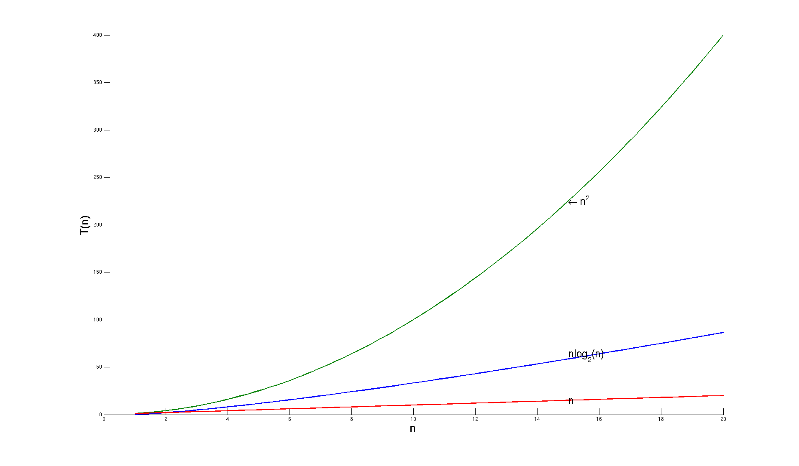

##`O(n^2)` vs. `O(n*lg(n))` - Practical Examples

It should be clear now that for any moderately large inputs, algorithms 
that run in `O(n*lg(n))` time will significantly outperform those that run 
in `O(n^2)`. 



While one of the goals of algorithm analysis is to stay agnostic of implementation details, let's briefly take a look at what this means in practice. Let's look at a timed comparison of Merge Sort and Bubble Sort for randomized array inputs of varying sizes. 

To begin, run the sorting_demo.rb script in your terminal. The demo will run 3 timed trials for each sorting algorithm with a randomized input of increasing size, and compute the average time taken to sort the arrays. As you go through this demo, note that your running times may vary significantly from mine depending on your machine and the result of the array randomizer, but should they grow at roughly the same rate. 


Let's start with something small: press any key twice to run Merge Sort and Bubble Sort for 5 elements. The results here are fairly uninteresting: the running time for both is so small that any differences are negligible. The story is similar in running this for the next batch, 50 elements. 

Now let's move on to 500 elements. 

```
Press any key to run Merge Sort for 500 elements:
On average, Merge Sort took 0.0082 seconds.
Press any key to run Bubble Sort for 500 elements:
On average, Bubble Sort took 0.0279 seconds.
```

We're beginning to see some separation here between the performance of the two. In practice, though, this doesn't mean much to us; on my machine, both are still taking well under a second to run. What about 5000 elements?

```
Press any key to run Merge Sort for 5000 elements:
On average, Merge Sort took 0.0253 seconds.
Press any key to run Bubble Sort for 5000 elements:
On average, Bubble Sort took 2.7528 seconds.
```

We can see the times starting to properly diverge. At 5000 elements, Bubble Sort no longer feels instantaneous. If we were writing an application where the user needed to wait for the results of the sort to continue, this would start significantly affecting their experience.

Run Merge Sort for 50,000 elements. On my machine, this still runs in 
a reasonable amount of time. 

```
Press any key to run Merge Sort for 50000 elements:
On average, merge sort took 0.2796 seconds.
```

Lastly, run Bubble Sort on the 50,000 element inputs. 

Can you give a rough estimate of how long this will take, even with randomized input? What factors would go into whether your estimate would be high or low? Picking different algorithms to solve a problem can lead to significant differences in application performance at scale.

When Bubble Sort has finished running, go ahead and play around with the input size a bit more. You can specificy the default base and number of runs by modifying SortingDemo::run_performance_tests. Approximately how long will it take to run this for 100,000 elements, based on how long your machine took to run the other tests?